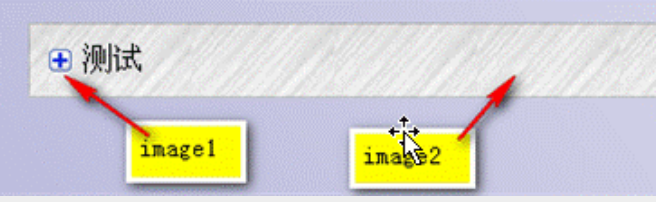

CSS3给我们带来了什么好处呢？简单的说，CSS3把很多以前需要使用图片和脚本来实现的效果、甚至动画效果，只需要短短几行代码就能搞定。比如圆角，图片边框，文字阴影和盒阴影，过渡、动画等。

CSS3简化了前端开发工作人员的设计过程，加快页面载入速度。

CSS3都有哪些强大功能呢？各位小伙伴们先来一睹为快吧！

选择器
以前我们通常用class、 ID 或 tagname 来选择HTML元素，CSS3的选择器强大的难以置信。它们可以减少在标签中的class和ID的数量更方便的维护样式表、更好的实现结构与表现的分离。

 

圆角效果
以前做圆角通常使用背景图片，或繁琐的元素拼凑，现在很简单了 border-radius 帮你轻松搞定。
;
 

块阴影与文字阴影
可以对任意DIV和文字增加投影效果。

 

色彩
CSS3支持更多的颜色和更广泛的颜色定义。新颜色CSS3支持HSL ， CMYK ，HSLA and RGBA。

 

渐变效果
以前只能用Photoshop做出的图片渐变效果，现在可以用CCS写出来了。IE中的滤镜也可以实现。

 

个性化字体
网页上的字体太单一？使用@Font-Face 轻松实现定制字体。

 

多背景图
一个元素上添加多层背景图片。

 

边框背景图
边框应用背景图片。

 

变形处理
你可以对HTML元素进行旋转、缩放、倾斜、移动、甚至以前只能用JavaScript实现的强大动画。

 

多栏布局
可以让你不用使用多个div标签就能实现多栏布局。浏览器解释这个属性并生成多栏，让文本实现一个仿报纸的多栏结构。

 

媒体查询
针对不同屏幕分辨率，应用不同的样式。

等等 ……

很神奇吧！CSS3使代码更简洁、更高效。可以极大的提高工作效率，打造更高级的用户体验。使web应用的界面设计进入一个新的台阶。