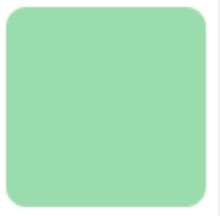
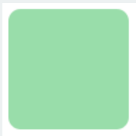

border-radius是向元素添加圆角边框。

使用方法：

border-radius:10px; `/* 所有角都使用半径为10px的圆角 */ `



border-radius: 5px 4px 3px 2px; `/* 四个半径值分别是左上角、右上角、右下角和左下角，顺时针 */ `



不要以为border-radius的值只能用px单位，你还可以用百分比或者em，但兼容性目前还不太好。

实心上半圆：

方法：把高度(height)设为宽度（width）的一半，并且只设置左上角和右上角的半径与元素的高度一致（大于也是可以的）。

```js
div{
    height:50px;/*是width的一半*/
    width:100px;
    background:#9da;
    border-radius:50px 50px 0 0;/*半径至少设置为height的值*/
    }
```
实心圆：
方法：把宽度（width）与高度(height)值设置为一致（也就是正方形），并且四个圆角值都设置为它们值的一半。如下代码：

```js
div{
    height:100px;/*与width设置一致*/
    width:100px;
    background:#9da;
    border-radius:50px;/*四个圆角值都设置为宽度或高度值的一半*/
    }
```