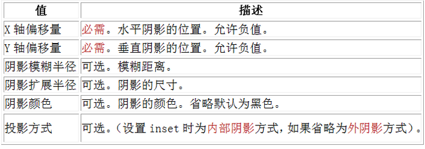
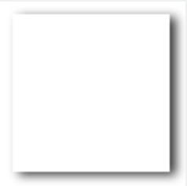
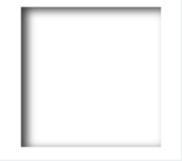
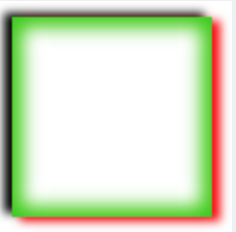

box-shadow是向盒子添加阴影。支持添加一个或者多个。

很简单的一段代码，就实现了投影效果，酷毙了。我们来看下语法：



>box-shadow: X轴偏移量 Y轴偏移量 [阴影模糊半径] [阴影扩展半径] [阴影颜色] [投影方式];

参数介绍：

注意：inset 可以写在参数的第一个或最后一个，其它位置是无效的。

为元素设置外阴影：

示例代码：

```js
.box_shadow{
  box-shadow:4px 2px 6px #333333; 
}
```

效果：



为元素设置内阴影：

示例代码：

```js
.box_shadow{
  box-shadow:4px 2px 6px #333333 inset; 
}
```
效果：



添加多个阴影：

以上的语法的介绍，就这么简单，如果添加多个阴影，只需用逗号隔开即可。如：

```js
.box_shadow{
    box-shadow:4px 2px 6px #f00, 
    -4px -2px 6px #000, 
    0px 0px 12px 5px #33CC00 inset;
}
```
效果：

